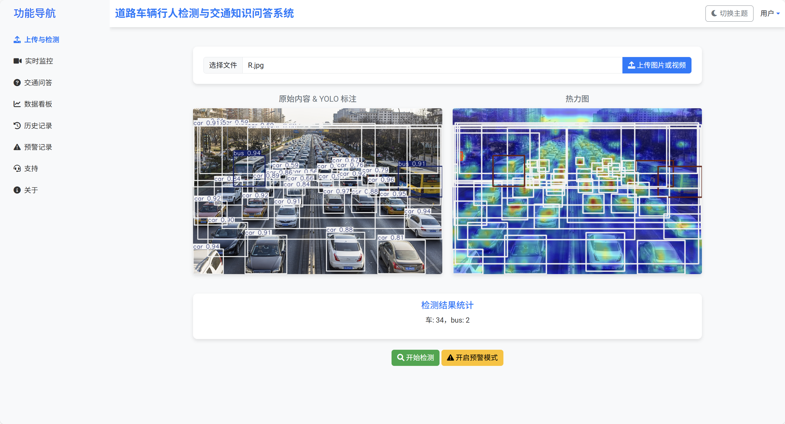

# [项目名称] -基于改进YOLOv8与DeepSeek微调的智能交通监控与问答系统 :heart: :heart: :heart:



## :rocket:项目概述

**一、项目介绍**
本项目结合深度学习与前端交互技术，开发了智能道路交通分析系统——RoadAnalyzer。系统以 YOLOv8 模型为核心，结合 SORT 跟踪算法、单应矩阵速度估计及 FastAPI 后端服务，实现集成图像检测、视频分析、热力图生成，交通知识ai问答，实时预警功能。用户可上传图片或视频，获取道路中车辆与行人的精准检测结果、速度信息、交通状态评估及可视化展示，为交通管理和智能监控提供高效支持。

**二、核心功能**
1、智能检测：上传图片后自动识别道路中的车辆与行人，基于自定义数据集训练的 YOLO模型，添加CBAM注意力集中机制，优化了复杂场景下的目标检测精度。
2、热力图生成：利用 YOLOv8 的特征提取能力，生成目标分布热力图，直观展示密集区域
3、实时目标跟踪与速度估计：视频分析中引入 SORT（Simple Online and Realtime Tracking）算法，结合卡尔曼滤波与 IOU 匹配，确保目标 ID 稳定，减少跟踪丢失。通过单应矩阵将像素坐标映射到现实世界坐标，精确计算车辆速度（单位：km/h）。
4、预警系统：实现多维度交通预警，包括：
超速检测：监控车辆速度，超速（>60 km/h）时触发预警。
危险区域入侵：检测车辆或行人进入指定区域（如路口禁行区）。
拥堵分析：根据目标密度判断交通拥堵状态。
行人停留：识别长时间停留的行人，提示潜在异常。
5.ai问答：通关deepseek-R1 1.5b进行微调实现智能交通问答系统

**三、技术点**
1.计算机视觉：针对道路场景定制 YOLOv8，添加 CBAM 注意力机制，优化多尺度目标检测。
模型推理速度快（支持实时视频处理），适应多样化光线、视角及天气条件。
2.鲁棒的目标跟踪：集成 SORT 算法，结合卡尔曼滤波平滑轨迹，IOU 匹配减少 ID 切换。
单应矩阵速度估计，映射精度高，速度计算稳定，误差小。
3.大模型应用：对deepseek-r1 1.5b模型微调，使用lora在5000条交通知识语料上微调

**四、技术栈**
网络：YOLOv8n +CBAM
后端：Fastapi后端，FastAPI 提供高性能 API，支持异步处理，集成 SQLite 数据库存储预警记录。
前端：HTML/CSS/JavaScript 实现现代化界面，AJAX 确保无刷新交互，响应速度快。
部署：Windows 环境（Anaconda, Python），路径规范化（如 D:\AAbackend\static），便于维护。
数据库：sqLite

## :bulb:安装依赖

```
pip install -r requirements.txt #包含ultralytics、fastapi等依赖
```

## :hammer_and_wrench:项目结构

AAbackend/
├── static/                   # 前端静态文件    
│   ├── index.html            # 主页面（检测、监控、问答等  
│   ├── login.html            # 登录页面    
│   ├── script.js             # 前端逻辑（导航、上传  
│   ├── styles.css            # 样式（含黑夜模式）  
│   ├── uploads/              # 上传文件存储  
│   ├── annotated/            # 检测结果（标注图片/视频）  
│   ├── warnings/             # 预警图片  
│   └── heatmap/              # 热力图  
├── routes/                     # FastAPI 路由  
│   ├── upload.py            # 文件上传  
│   ├── detect.py            # 检测逻辑  
│   ├── stream.py            # 实时监控流  
│   └── websocket.py         # WebSocket  
├── utils/                    # 工具模块  
│   ├── inference.py         # YOLO 推理（检测、跟踪、预警）  
│   ├── sort.py         # sort多目标跟踪算法   
│   └── yolov8_heatmap.py    # 热力图生成  
├── models/  
│   └── best.pt              # YOLOv8 模型    
├── database.py              # SQLite 数据库（记录检测、预警、问答）  
├── main.py                  # FastAPI 主程序  
├── READ.ME                  # README说明  
├── traffic_data.db          # SQLite 数据库文件  
└── requirements.txt         # 依赖  

## :handbag:使用说明

```
1.安装好依赖后,启动FastAPI Web服务
cd AAbackend
uvicorn main:app --reload
2.打开浏览器，访问http://127.0.0.1:8000
3.上传图片或视频，进行目标检测
4.查看结果
```

## :star2:修改说明

1. 可自主替换模型
2. 可自主调整热力图参数，可查看文件注释
3. 可自主替换语言微调模型

## :stars:感谢

感谢[Ultralytics](https://github.com/ultralytics)提供的YOLO模型。
感谢[魔鬼面具](https://github.com/z1069614715)提供的热力图展示功能。
感谢(https://github.com/abewley/sort)算法支持
